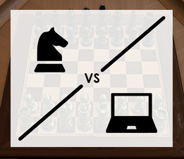

# Welcome to Chess Against the Machine!

Chess Against the Machine is a mod for Tabletop Simulator that integrates a chess engine written fully in Lua into TTS's runtime environment so that players can play chess against the computer.

You play just like you normally would: by picking up and moving your in-game pieces. The mod detects the your move and sends it to the chess engine, which then calculates its move in response. Once the mod receives the engine's move, it physically executes the move on the board.

Chess Against the Machine uses [sunfish.lua](https://github.com/soumith/sunfish.lua) as its core chess engine, adapted to work within Tabletop Simulator. Special thanks to sunfish.lua's author, Soumith Chintala!

Features:
- Chess engine incorporated directly into TTS's runtime environment
- Player moves detected automatically
- Engine moves played automatically on the virtual board
- Fully traversable game history, including the ability to play a different variation at a previous turn (subsequent history will be erased, and not available after game ends)

Please note: Chess Against the Machine is in alpha and has substantial limitations and bugs, both known and unknown. Limitations:
- Running the engine inside TTS makes it abnormally slow and limits its playing ability—it probably won't be a match for an expert
- Moving pieces erratically may cause bugs
- Saving and loading aren't implemented—attempting to save and load will probably break the game
- The engine can't detect checks, so players can move/leave the king in check, causing it to be captured

Want to make this mod better? Fork it and submit a pull request! :)

---

Image credits:

Chess knight icon made by Pixel perfect from www.flaticon.com

Laptop icon made by Freepik from www.flaticon.com
